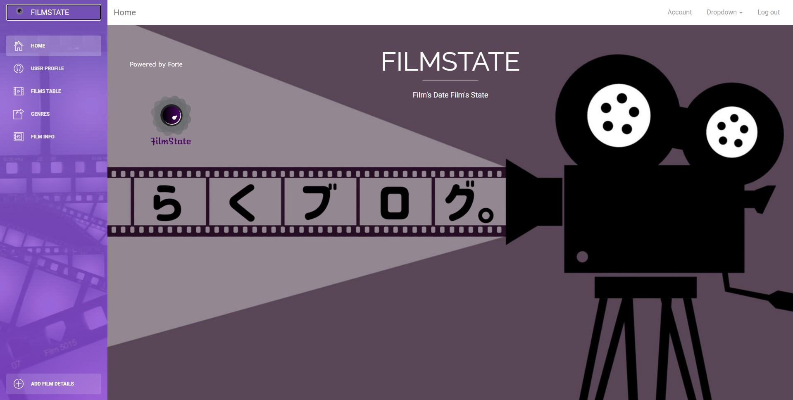

# [FilmState Angular]
[![version][version-badge]][CHANGELOG] ![license][license-badge]



## Terminal Commands

1. Install NodeJs from [NodeJs Official Page](https://nodejs.org/en).
2. Open Terminal
3. Go to your file project
4. Run in terminal: ```npm install -g @angular/cli```
5. Then: ```npm install```
6. PrimeNg ```npm install primeng@11.0.4```
7. PrimeIcons ```npm install primeicons```
8. And: ```ng serve```
9. Navigate to `http://localhost:4200/`
 

